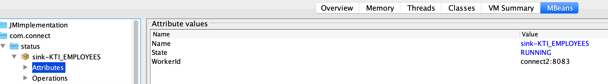
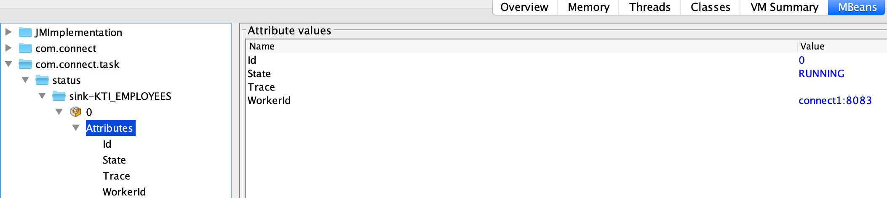

# Welcome to Kafka-Connect-Monitor(KCM)
Kafka connect is an awesome way to integrate your source and sink apps to Kafka. 

But Kafka connect does not provide any proactive alerting in case your connect task dies due to external failure.

KCM is a tool which monitors your Kafka connect cluster for any tasks/connector which go down.

Every time it polls the connectors api, it stores the results in JMX metrics, which you can then use with a monitoring tool like **Prometheus/Grafana** to send out alerts.

Refer the [kcm.yml file](kcm.yml) for a sample on how to extract the JMX metrics to be consumed by Prometheus.

For connector status MBean is exposed with object `com.connect:type=status` and has attributes `state` and `workerId`.

For connector task status MBean is exposed with object `com.connect.task:type=status` and has attributes `id`, `sate`, `trace` and `workerId`.

When run with environment variable `ALERTS_ENABLED=true` it sends out Email alerts for specified states.

You can configure KCM to send out the alerts for states (RUNNING, PAUSED or FAILED) that you are interested in.

KCM also has a api with swagger documentation page which can be accesed at  [URL]/swagger-ui.html#/connector-controller

### How to run?
You can run KCM in two ways

* Build your jar 
  * Build jar using `./gradlew clean build`
  * Export environment variables
  * Run jar using `java -jar  build/libs/kafka-connect-monitor-1.0.0.jar `. To use with prometheus using [jmx-exporter](https://github.com/prometheus/jmx_exporter) run like this java -javaagent:../jmx_prometheus_javaagent-0.12.0.jar=8081:kcm.yml -jar build/libs/kafka-connect-monitor-1.0.0.jar
* Run the docker container 
    * run the docker container using this command `docker run -e ALERT_ENABLED=true -e CONNECT_URL=[CONNECT URL] -e SMTP_HOST=[SMTP HOST] -e SMTP_PORT=[SMTP PORT] -e SMTP_TO=[TO ADDRESS] -e SMTP_FROM=[FROM ADDRESS] -e ROOT_URL=http://localhost:8080  -p 8080:8080  rahulbats/kafka-connect-monitor:LATEST_TAG`

### List of environment variables
#### Table below describes the environment variables. Refer the [application.properties file](src/main/resources/application.properties) on how these are used.
| Environment Variable | Optional | Description |
| --- | --- | --- |
| CONNECT_URL | No | URL of the connect cluster |
| ALERT_ENABLED | No | EMAIL alert is enabled or not. Default false |
| FREQUENCY | Yes | Frequency in milliseconds of alerts. Default is 300000 (5 minutes) |

Send the following environment variables if `ALERT_ENABLED=true`

| Environment Variable | Optional | Description |
| --- | --- | --- |
| SMTP_HOST | Yes | SMTP host for EMAIL alert|
| SMTP_PORT | Yes | SMTP port |
| SMTP_TO | Yes | To email address |
| SMTP_AUTH | Yes | SMTP auth enabled, default false |
| SMTP_USERNAME | Yes | SMTP username if auth is enabled |
| SMTP_PASSWORD | Yes | SMTP password if auth is enabled |
| ENVIRONMENT | Yes | Environment name which will be included in the email subject, default DEV |
| ROOT_URL | Yes | Root URL of the KCM server for the APIs. Default http://localhost:8080 |
  